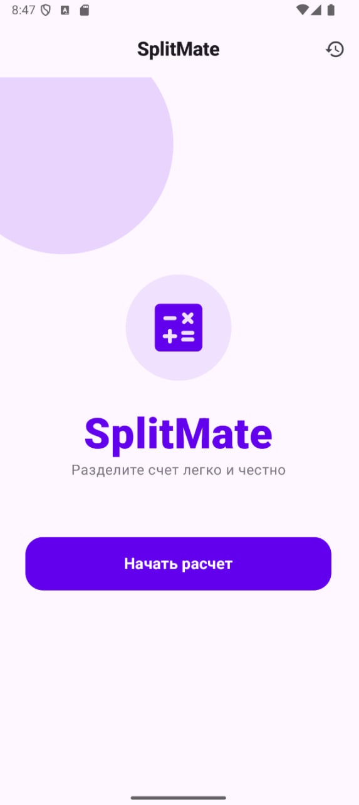
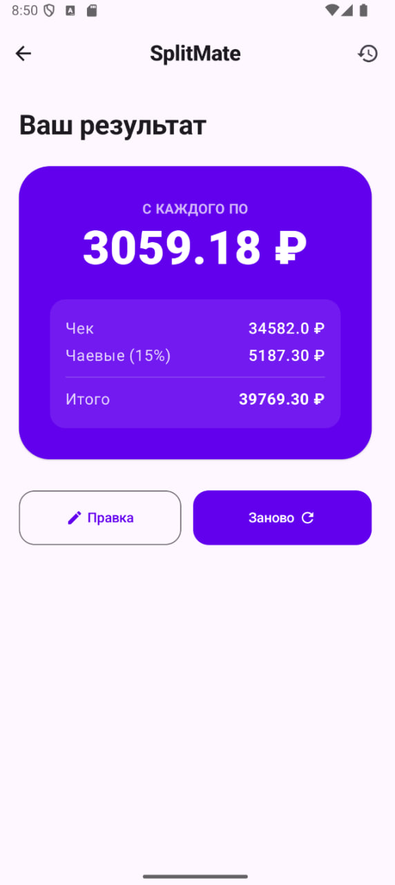
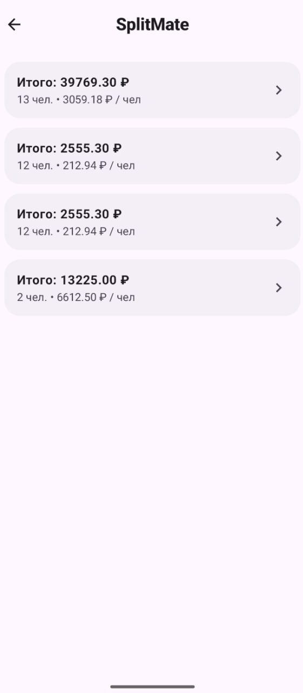
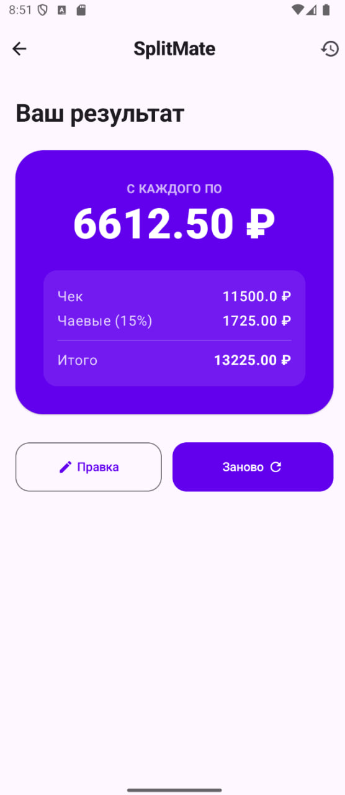

# SplitMate - калькулятор разделения счета

Приложение для расчета суммы оплаты на каждого участника компании с учетом чаевых. 

Основные функции:
- Главный экран с переходом к расчету.
- Поля ввода суммы счета и количества человек с проверкой корректности данных.
- Отображение итоговой суммы на человека и размера чаевых (15%).
- Сохранение истории последних 5 расчетов.

Скриншоты работы приложения:

| Главный экран | Ввод данных | Результат |
|:---:|:---:|:---:|
|  |  |  |

| Список истории | Результат из истории |
|:---:|:---:|
|  |  |

Технологии:
- Jetpack Compose
- ViewModel
- Navigation Compose
- Material 3
